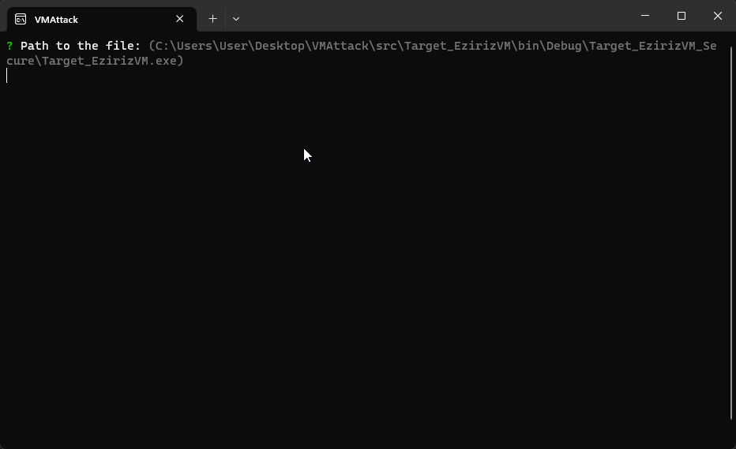

## What can it do now?

| EzirizVM             | Supported |
|-----------------------|:---------:|
| Stream Reader         |    yes    |
| Operands              |    yes    |
| Strings               |    yes    |
| Method Keys           |    yes    |
| Method Reading Offsets|    yes    |
| Local Reader (with types)|  yes   |
| Exception Reader      |    yes    |
| Instruction Reader    |    yes    |
| Exception Handler     |    yes    |

## How does it look now?

```csharp
// Normal function 

[Obfuscation(Feature = "virtualization", Exclude = false)]
private static int Test()
{
	int a = 1;
	int b = 1;
	return a * b + 1;
}
```

```c
// IL Code of Test()

.locals init (
	[0] int32
)
/* (15,4)-(15,16) main.cs */
/* 0x000002E0 17           */ IL_0000: ldc.i4.1
/* (16,4)-(16,14) main.cs */
/* 0x000002E1 17           */ IL_0001: ldc.i4.1
/* 0x000002E2 0A           */ IL_0002: stloc.0
/* (17,4)-(17,23) main.cs */
/* 0x000002E3 06           */ IL_0003: ldloc.0
/* 0x000002E4 5A           */ IL_0004: mul
/* 0x000002E5 17           */ IL_0005: ldc.i4.1
/* 0x000002E6 58           */ IL_0006: add
/* 0x000002E7 2A           */ IL_0007: ret
```

```c
// Disassembled virtualized code from EzirizVM

Created new method_0001, reading from offset 0x0001B29D.
Reading method at offset 0x1B29D
 Method parent is Test
Reading 1 locals...
 V_0000 : Type Int32 : IsByRef: False
Reading 0 exception handlers...
Reading 8 instructions...
 0x1B2A6: opcode_Unknown (163) 1    /* ldc.i4.1 */

 0x1B2A8: opcode_Unknown (163) 1    /* ldc.i4.1 */
 0x1B2AA: opcode_Unknown (28) 0     /* stloc.0 */

 0x1B2AC: opcode_Unknown (81) 0     /* ldloc.0 */
 0x1B2AE: opcode_Unknown (100)      /* mul */
 0x1B2AF: opcode_Unknown (163) 1    /* ldc.i4.1 */
 0x1B2B1: opcode_Unknown (73)       /* add */
 0x1B2B2: opcode_Unknown (37)       /* ret */
```

... the vm opcode values are different every build, so we need to build solution to resolve them back to the IL.


See [here](https://github.com/void-stack/VMAttack/blob/dev/src/VMAttack.Pipeline/VirtualMachines/EzirizVM).


# Project Status [very WIP]

This project is heavily work in progress and is being created as a study for me and new reversers in .NET VM to explore and learn about code obfuscation techniques and how to reverse engineer them. 

The main focus currently of this project is on [.NET Reactor 6.9.0.0](https://www.eziriz.com/), which has a simple 1:1 CIL virtual machine.



# Introduction

Code obfuscation is a technique used to protect software code from reverse engineering. It makes the code difficult to understand, analyze, and modify by humans, making it harder for adversaries to access proprietary code or execute malicious attacks.

Virtualization is the most common form of code obfuscation. It transforms code into a virtual program that is no longer recognizable as its original source code, allowing it to be executed without the need for a human-readable form. However, this makes it difficult for security analysts to understand the behavior of virtualized programs, as the internal mechanism of commercial obfuscators is a black box.

# Point

Malware authors are increasingly using commercial obfuscators to make their code more difficult to reverse engineer. Obfuscators make code harder to read, analyze, and comprehend, which can hide the functionality of malicious code and evade detection by antivirus software.

The most popular obfuscators used by malware authors include Eazfuscator.NET, .Net Reactor, VMProtect, Agile, and ConfuserEX KoiVM. These obfuscators use techniques such as string encryption, control flow obfuscation, and code virtualization to make code more difficult to understand.

However, some of these obfuscators are not foolproof and can be defeated by skilled security researchers.Therefore, it's important for security researchers to remain vigilant and employ appropriate countermeasures to detect and identify malware that uses commercial obfuscators.

## Dependencies

This project is using the following dependencies:
- [Echo Framework](https://github.com/Washi1337/Echo): an experimental .NET assembly editor and manipulation framework
- [AsmResolver](https://github.com/Washi1337/AsmResolver): a library that provides a complete set of tools to read and modify .NET assemblies, including a fully-featured CIL (Common Intermediate Language) assembler and disassembler.
- [UseEveryOpCode](https://github.com/0xInception/UseEveryOpCode): a .NET assembly that contains a single method that uses every CIL opcode, which can be useful for testing and experimentation purposes.


## 💵 Want to support?
- Donate BTC at `bc1q048wrqztka5x2syt9mtj68uuf73vqry60s38vf`
- Donate ETH at `0x86b2C17C94A1E6f35d498d17a37dc1f8A715139b`