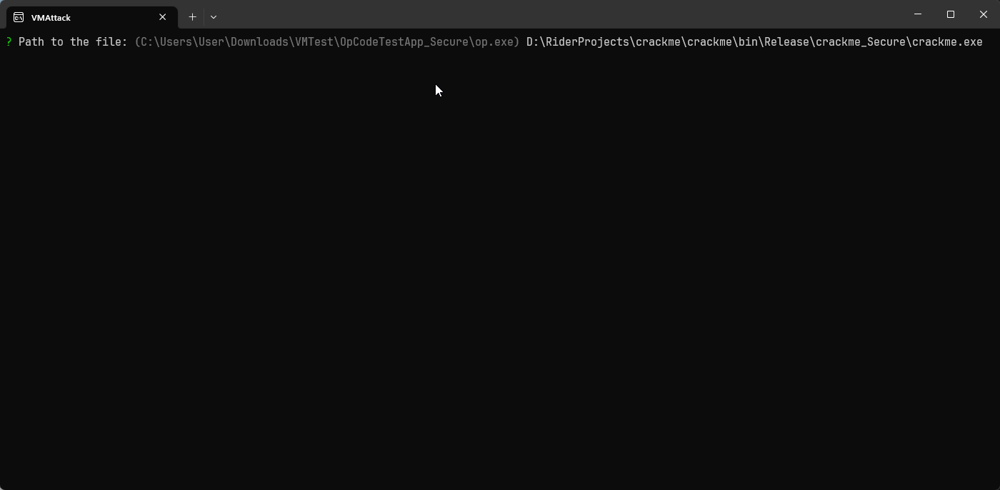
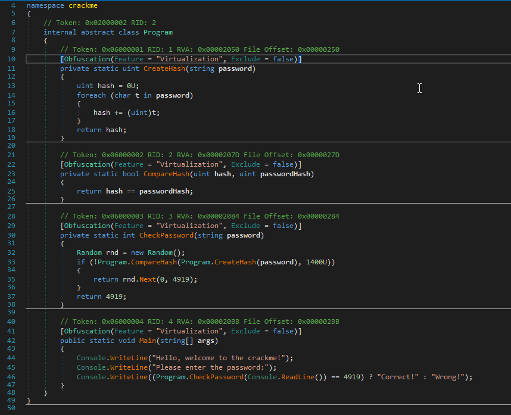
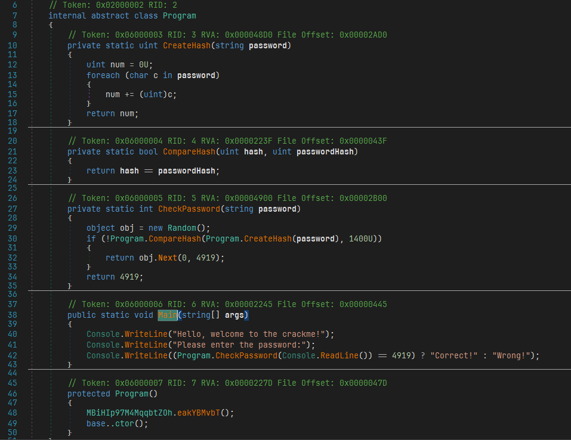

# Eziriz .NET Reactor Research
 [.NET Reactor](https://www.eziriz.com/), which has a 1:1 CIL virtual machine.
Code virtualization was introduced in version `6.2.0.0`

## Supported Version
- **.NET Reactor [6.9.0.0](#ver-6.9.0.0)**

----------

# Showcase

 

# Crackme example

 

# Virtualized sample

 

# Devirtualized sample

 

Implementation [here](https://github.com/void-stack/VMAttack/blob/dev/src/VMAttack.Pipeline/VirtualMachines/EzirizVM).

Implemented Handler patterns [here 6.9.0.0](https://github.com/void-stack/VMAttack/tree/dev/src/VMAttack.Pipeline/VirtualMachines/EzirizVM/PatternMatching/OpCodes).

**Detailed research coming soon...**

## Credits
- [tobitofatito](https://forum.tuts4you.com/profile/101602-tobitofatito/)
- [puff](https://github.com/puff)
- [0xInception](https://github.com/0xInception/UseEveryOpCode)