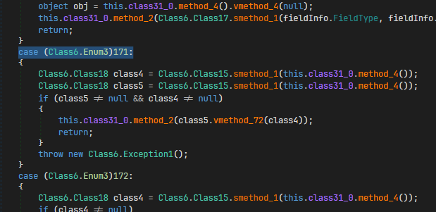

# Eziriz .NET Reactor Research
 [.NET Reactor](https://www.eziriz.com/), which has a 1:1 CIL virtual machine.
Code virtualization was introduced in version `6.2.0.0`

## Supported Version
- **.NET Reactor [6.9.0.0](#ver-6.9.0.0)**

----------

## 6.9.0.0


```csharp
// Normal function 

[Obfuscation(Feature = "virtualization", Exclude = false)]
private static int Test()
{
    int a = 1;
    int b = 1;
    return a * b + 1;
}
```

```c
// IL Code of Test()

.locals init (
    [0] int32
)
/* (15,4)-(15,16) main.cs */
/* 0x000002E0 17           */ IL_0000: ldc.i4.1
/* (16,4)-(16,14) main.cs */
/* 0x000002E1 17           */ IL_0001: ldc.i4.1
/* 0x000002E2 0A           */ IL_0002: stloc.0
/* (17,4)-(17,23) main.cs */
/* 0x000002E3 06           */ IL_0003: ldloc.0
/* 0x000002E4 5A           */ IL_0004: mul
/* 0x000002E5 17           */ IL_0005: ldc.i4.1
/* 0x000002E6 58           */ IL_0006: add
/* 0x000002E7 2A           */ IL_0007: ret
```

```c
// Disassembled virtualized code from EzirizVM

Created new method_0001, reading from offset 0x0001B29D.
Reading method at offset 0x1B29D
 Method parent is Test
Reading 1 locals...
 V_0000 : Type Int32 : IsByRef: False
Reading 0 exception handlers...
Reading 8 instructions...
 0x1B2A6: opcode_Unknown (163) 1    /* ldc.i4.1 */

 0x1B2A8: opcode_Unknown (163) 1    /* ldc.i4.1 */
 0x1B2AA: opcode_Unknown (28) 0     /* stloc.0 */

 0x1B2AC: opcode_Unknown (81) 0     /* ldloc.0 */
 0x1B2AE: opcode_Unknown (100)      /* mul */
 0x1B2AF: opcode_Unknown (163) 1    /* ldc.i4.1 */
 0x1B2B1: opcode_Unknown (73)       /* add */
 0x1B2B2: opcode_Unknown (37)       /* ret */
```

... the vm opcode values are different every build, so we need to build a solution to resolve them back to the IL.
research coming soon...


## Handler code
---------------


</br>

## Dumping handlers
-------------------


Implementation [here](https://github.com/void-stack/VMAttack/blob/dev/src/VMAttack.Pipeline/VirtualMachines/EzirizVM).

**Detailed research coming soon...**

## Credits
- [tobitofatito](https://forum.tuts4you.com/profile/101602-tobitofatito/)
